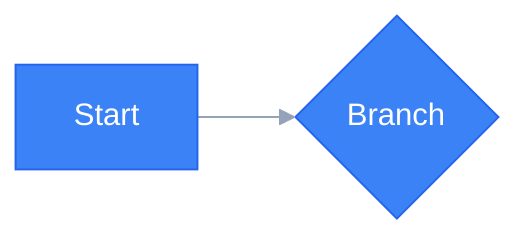

# Slidev Design & Engineering Rules

ユーザーの要望に基づき、**Slidev (Markdown + Vue/UnoCSS)** 形式のスライドコードを作成する際のルール。

## 1. デザイン原則 (Design Principles)

### A. レイアウト: Bento Grid

Apple スタイルのモジュラーカード配置を採用する。

- **実装**: `grid grid-cols-2 gap-6` や `grid-cols-3 gap-4` で情報をブロック化
- **近接**: 関連要素はカードでグループ化し、情報のまとまりを視覚化する
- **整列**: テキストは原則 `text-left`。`text-center` はタイトルスライドや強調フレーズのみ
- **余白**: カード間は `gap-4` 以上。コンテンツとカード端は `p-5` 以上を確保

### B. 配色: ダークテーマ基本パレット

色数を厳しく絞る。**ベースカラー + アクセント1色** を原則とし、意味のある場合のみ追加色を許可する。

#### 推奨カラーパレット (Dark Theme)

| 役割 | Hex | Tailwind | 用途 |
|------|-----|----------|------|
| Background | `#0F172A` | `bg-[#0F172A]` | スライド背景 (slate-900 相当) |
| Surface | `rgba(255,255,255,0.1)` | `bg-white/10` | カード・ブロック背景 |
| Text Primary | `#F1F5F9` | `text-slate-100` | 本文テキスト |
| Text Muted | — | `opacity-70` | 補足テキスト (色は変えず不透明度で階差) |
| Text Dimmed | — | `opacity-50` | 注釈・ラベル |
| Accent | `#3B82F6` | `text-blue-400` / `text-primary` | 強調・見出し |
| CTA/Highlight | `#2563EB` | `text-blue-500` | 最重要メッセージ |

#### 配色ルール

- **不透明度で階層を表現する**: 補足情報は `opacity-70`、注釈は `opacity-50`。色を変えるのではなく不透明度で差をつける
- **セマンティックカラーは例外的に許可**: Scan=赤 / Query=青 のような対比や、緑/黄/赤の信号機パターンなど、意味のある色分けは許可
- **1スライド内の色数**: アクセント含め最大3色まで。4色以上は原則禁止

#### コントラスト要件

- 本文テキスト: **4.5:1 以上** (WCAG AA)
- 大きな見出し (24px 以上 or 18px bold 以上): **3:1 以上**
- **色だけで情報を伝えない**: 色に加えてテキストやアイコンを併用する

### C. タイポグラフィ

#### フォント推奨 (日本語テック発表)

| 用途 | フォント | 特徴 |
|------|----------|------|
| 見出し | Noto Sans JP (Bold/SemiBold) | 日本語の可読性が高く、クリーンな印象 |
| 本文 | Noto Sans JP (Regular) | ウェイトバリエーションで階層を表現 |
| コード | JetBrains Mono | 開発者に馴染みのあるモノスペース |

> Slidev は seriph テーマのデフォルトフォントで十分に美しい。カスタムフォントは必要な場合のみ設定する。

#### タイプスケール (Modular Scale)

スライド内で使用するフォントサイズは以下のスケールに統一する。

| レベル | Tailwind | px相当 | 用途 |
|--------|----------|--------|------|
| Hero | `text-5xl` | 48px | タイトルスライドのメインテキスト |
| H1 | `text-4xl` | 36px | セクション見出し |
| H2 | `text-3xl` | 30px | スライド内の強調メッセージ |
| H3 | `text-2xl` | 24px | カード内の見出し・キー数値 |
| Body Large | `text-xl` | 20px | まとめ文・重要な補足 |
| Body | `text-lg` | 18px | 本文 |
| Small | `text-sm` | 14px | ラベル・注釈・補足情報 |

- **隣接サイズの落差は最大2段階**: `text-4xl` の横に `text-sm` を直接並べない。間に中間サイズを挟む
- **行間**: 本文は `leading-relaxed` (1.625) を推奨
- **太さの階層**: `font-bold` は見出し・強調のみ。本文に `font-bold` を多用しない

### D. 装飾: "Less is More"

- 意味のない装飾線や過剰な色は排除する。「あった方がいいかも」は「ない方がいい」
- **アイコン**: 絵文字は使わない。Iconify (`<uil:github />`, `<carbon:cloud />`) の SVG アイコンを使用
- **アニメーション**: `v-click` は1スライドにつき最大2〜3回。多用は集中力を削ぐ

### E. カードコンポーネント

全てのカードは以下のベーススタイルを適用する。

```html
<div class="bg-white/10 p-5 rounded-xl border border-gray-400/20 backdrop-blur-md shadow-sm">
  <h3 class="text-xl font-bold text-blue-400 mb-2">Title</h3>
  <p class="text-sm opacity-80">Content...</p>
</div>
```

- `backdrop-blur-md`: グラスモーフィズムの奥行き感を付与
- `shadow-sm`: 微細なシャドウで浮遊感を演出
- `rounded-xl`: 16px 角丸で柔らかい印象
- `border border-gray-400/20`: 暗い背景上での境界線の視認性を確保

### F. アニメーション & トランジション

| 種類 | 推奨時間 | 備考 |
|------|----------|------|
| マイクロインタラクション | 150〜300ms | ホバー、フェードイン |
| ページ遷移 | `slide-left` | Slidev の transition 設定 |
| v-click の出現 | デフォルト | Slidev 標準を使用 |

- 300ms を超えるアニメーションは体感で「もっさり」するため避ける
- `v-click` 以外のカスタムアニメーションは最小限にとどめる

## 2. 技術仕様 (Technical Specifications)

### A. Frontmatter

```yaml
---
theme: seriph
background: "#0F172A"
title: [スライドタイトル]
class: text-center
transition: slide-left
mdc: true
---
```

### B. Mermaid.js

デフォルトの Mermaid は原色がきつくスライドから浮くため、必ず `themeVariables` を指定する。



### C. Vue/UnoCSS コンポーネント

- **アイコン**: Iconify を使用 (`<uil:github />`, `<carbon:cloud-service />`)
- **グリッド**: `grid grid-cols-{n} gap-{n}` で Bento レイアウトを実装
- **カード**: セクション E のベーススタイルを適用

## 3. コンテンツ構成 (Storytelling)

単なる情報の羅列ではなく、聴衆を行動に導く構成にする。

1. **Hook (導入)**: 冒頭で「なぜこの話を聞く必要があるのか」を提示する
2. **Focus (本題)**: 1スライド・1メッセージ。情報を詰め込まない
3. **Action (結び)**: 具体的な次のアクションや、現場で試せることを促す

## 4. プロセス (Interaction Guide)

**重要:** ユーザーからの指示が曖昧な場合、いきなりコードを出力せず、まず以下を質問して要件を固める。

1. **Target**: ターゲットオーディエンスは？（初学者、経営層、エンジニアなど）
2. **Tone**: スライドの雰囲気は？（Tech/Dark、Clean/Light、Pop/Casual）
3. **Goal**: 最も伝えたい「核となるメッセージ」は？

## 5. セルフレビューチェックリスト

コードを出力する前に以下を確認する。

### 配色
- [ ] 1スライド内のアクセントカラーが3色以内
- [ ] 不透明度 (`opacity-70/50`) で階層を表現している
- [ ] セマンティックカラー以外で赤/黄/緑/紫を多用していない

### タイポグラフィ
- [ ] フォントサイズがモジュラースケールに準拠している
- [ ] 隣接するテキスト要素のサイズ落差が2段階以内

### カード & レイアウト
- [ ] 全カードに `backdrop-blur-md shadow-sm` が適用されている
- [ ] `rounded-xl` と `border border-gray-400/20` が統一されている
- [ ] グリッドレイアウト (`grid grid-cols-*`) を使用している

### 装飾
- [ ] 絵文字をアイコンとして使用していない (SVG を使用)
- [ ] `v-click` は1スライドにつき最大3回以内
- [ ] 意味のない装飾色・装飾線がない
